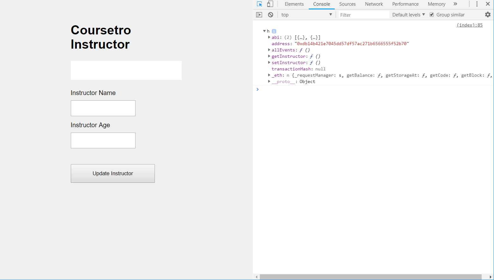

# Interacting with a Smart Contract through Web3.js
[Coursetro Link](https://coursetro.com/posts/code/99/Interacting-with-a-Smart-Contract-through-Web3.js-(Tutorial))

We are going to learn how to interact with deployed Smart Contract through Web3.

We need Node.js and node package manager(NPM) so we need to install those.

After installing it, check their version to see if they were installed properly.

~~~
> node -v
> npm -v
~~~

Now we need to install Ethereumjs-testrpc

testrpc is similar to private test network geth except it does not need to wait for the blocks or transactions to be processed.
Also it gives 10 default accounts with 100 eth each so we can test all we want.

It is basically ganache-core.

~~~
> npm install -g ethereumjs-testrpc
~~~

Now we use below command to start a testrpc

**One very important thing to keep in mind is to when restarting a testrpc, make sure you also refresh the
Remix browser page. If you don't it will be automatically connect to the restarted testrpc and the accounts will be locked. 
Make sure to refresh the page and set the Environment to Web3 Provider everytime.**

~~~
> testrpc //This is the default testrpc initiating command
~~~

Now let's make a project folder.
I have made the folder on the Desktop.

Go inside the folder and let's install local Web3.js.
> Web3.js is the official Ethereum Javascript API. Through Web3, we can interact with the contracts or accounts with Javascript code.

~~~
> mkdir coursetro-eth
> cd coursetro-eth
~~~

Then, inside the folder, we type init command to create a package.json, which will store project dependencies.
Just hit Enter whenever it asks for the options about the package.json
~~~
> npm init
~~~

Then we will install the web3.js
~~~
> npm install ethereum/web3.js --save
~~~

Now we will go to the [Remix IDE](http://remix.ethereum.org/#optimize=true&version=soljson-v0.4.18+commit.9cf6e910.js) and deploy a contract on testrpc.
In order to do that, we need to go to the Run tab and change the Environment into Web3 Provider.

> Do not use https Remix. Use http Remix. Using https might cause some trouble when integrating Web3 provider.

Hit okay and choose the testrpc local address which is http://localhost:8545

> You will see 3 options on Environment. Java Script VM, Injected Web3 and Web3 Provider. The differences between Injected and Provided Web3 is that the injected on use
Web3 from Browser application such as MetaMask which has an embedded Web3 provider. There, we can choose to connect to the testnet or the main network. The Provided Web3 is our own local Web3.
Since we have installed ethereum/web3.js, we will be using the Web3 Provider.

You will see the same amount of accounts from testrpc has also shown in the Remix IDE. That means it is now connected to our own testrpc.
You will also see the command window will continue to use eth_getBalance. It is normal behavior so do not worry.

Copy and paste the below contract code to the Remix. Please don't forget to match the version of the Solidity compiler.
Now deploy it. You might see the red circle on deployed transaction information. Do not worry. As long as the transaction were properly shown on the testrpc command, it has successfully deployed.
Also we need some more information from the Remix page so do not close it.

~~~Solidity
pragma solidity ^0.4.24;

contract Coursetro {

   string fName;
   uint age;

   function setInstructor(string _fName, uint _age) public {
       fName = _fName;
       age = _age;
   }

   function getInstructor() public constant returns (string, uint) {
       return (fName, age);
   }

}
~~~

Now we will create a simple html page to interact with the contract we have deployed.
Go inside the project folder where we can see node_modules folder, package.json file and the package-lock.json and make a file called
**index.html**. Use the code below when making the file.

~~~html
<!DOCTYPE html>
<html lang="en">
<head>
    <meta charset="UTF-8">
    <meta name="viewport" content="width=device-width, initial-scale=1.0">
    <meta http-equiv="X-UA-Compatible" content="ie=edge">
    <title>Document</title>

    <link rel="stylesheet" type="text/css" href="main.css">

    

</head>
<body>
    

        <h1>Coursetro Instructor</h1>

        <h2 id="instructor"></h2>

        <label for="name" class="col-lg-2 control-label">Instructor Name</label>
        <input id="name" type="text">

        <label for="name" class="col-lg-2 control-label">Instructor Age</label>
        <input id="age" type="text">

        <button id="button">Update Instructor</button>

    

    

    

</body>
</html>
~~~

Now on the same root, we will make simple css file to decorate the index.html.
Make a file called **main.css** using below code.

~~~CSS
body {
    background-color:#F0F0F0;
    padding: 2em;
    font-family: 'Raleway','Source Sans Pro', 'Arial';
}
.container {
    width: 50%;
    margin: 0 auto;
}
label {
    display:block;
    margin-bottom:10px;
}
input {
    padding:10px;
    width: 50%;
    margin-bottom: 1em;
}
button {
    margin: 2em 0;
    padding: 1em 4em;
    display:block;
}

#instructor {
    padding:1em;
    background-color:#fff;
    margin: 1em 0;
}
~~~

Now if you check our index.html code, you will see and empty 
~~~

**However, sometimes this code above cause the problem because of the if statement.** The if part will try to get the Web3 from the browser such as the Remix or the Mist. The else statement will try to get the Web3 from our local if the web3 is not defined.

The problem of using the Web3 from the browser, in this case the Remix, is that we won't be able to call the contract using statement such as Coursetro.setInstructor('myValue', 101) on a browser console. The reason for this is that the Remix does not allow this kind of statement to call a function. So we need to use or own local Web3 provider to use Coursetro. kind statement.

So we will only use **web3 = new Web3(new Web3.providers.HttpProvider("http://localhost:8545"));** line to make the code use our local web3.

~~~
  
~~~

Next, we will specify one of the account from the ten default account that testRPC gave us.
We will set it as default account for the interaction with the smart contract.

~~~

web3.eth.defaultAccount = web3.eth.accounts[0];

~~~

Next we need two ingredient to make the contract's instance.
First we need the ABI of the contract which can be copied by going through Compile tab and Clicking the detail button of the Remix.
There you will be able to copy and paste the whole ABI into **PASTE ABI HERE** down below.

~~~

var CoursetroContract = web3.eth.contract(PASTE ABI HERE!);

~~~

Then go back to the Run tab and copy the address of the smart contract that we deployed.
Put it in the **PASTE CONTRACT ADDRESS HERE**.

~~~

var Coursetro = CoursetroContract.at('PASTE CONTRACT ADDRESS HERE');
        console.log(Coursetro);

~~~

Now we have almost finished making the index.html that interacts with our smart contract through Web3.
However, if you just click open the index.html using Chrome browser, you will probably get an error when you open the console command of the browser.

The problem here is when you open the index.html, you open it with the folder path address. So you will probably see that the address of the index.html
in the browser is the path address of your project folder.

The Chrome does not allow this kind of approach and only accepts IP address form.
If you use other browser such as Internet Explorer or Microsoft Edge, you won't get the error as the Chrome. This is because these browser accepts
the folder path as an address.

So in order to run your html on Chrome, you need to use coming called **Web Server for Chrome.**
You can download this as Chrome expansion application.

After downloading the Web Server for Chrome, run the application and choose the folder path to your project folder, coursetro-eth, and choose the port something like 8887. Also avoid using 8545 cause testRPC is using that port number.

Then, click on local address which will be 127.0.0.1:8887.
After that, open up the console by pressing F12 or Ctrl + Shift + c.

If you have successfully set up the index.html and the testRPC, then it will look something like below.

We haven't made a function for the button yet, however you can interact with the contract by using the console commands below.
If you run into some error, make sure to check every settings we have made.

~~~
> Coursetro.setInstructor('Brutis', 44) // Hit Enter - You will set the value into the smart contract.
"0x894..."                           // This is the response (address)

> Coursetro.getInstructor()          // Hit Enter - You will get the value of the smart contract.
(2) ["brutis", e]                    // An array containing our data
~~~

Now, if you have successfully managed to set and get the value into the smart contract, then you are done.
We will finish our index.html by adding a function to the button.

This button will update the value inside the contract and when you refresh the index.html, it will show you the
value that you have entered.

~~~

~~~

This sums up the whole process of interacting with the contract.
This article was made to help the people who had trouble following the linked lessons which did not responded well
with the errors people having.

I hope this article will be helpful those who wants to learn about interacting with the smart contract.
